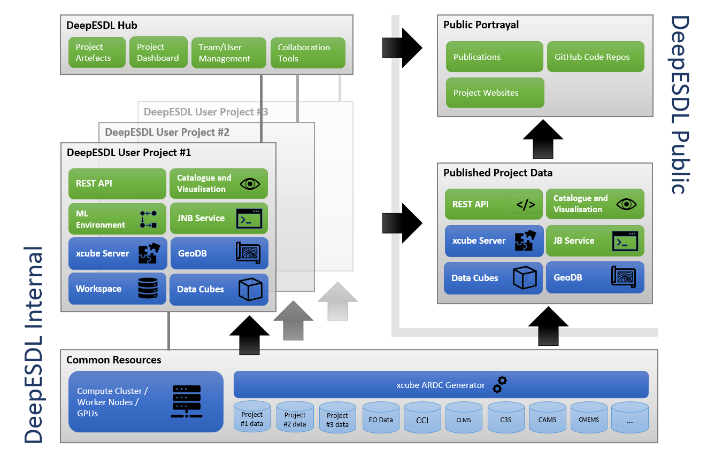

# Context

It is focused on the idea of on-boarding new 
*DeepESDL user projects* with the help of the 
*DeepESDL Hub* which can be seen as an implementation of the 
[ESA Earth Science Hub](https://www.esa.int/Applications/Observing_the_Earth/FutureEO/Boosting_Earth_science). 
Accordingly, a DeepESDL user project may support specific 
[ESA EO for Society](https://eo4society.esa.int/) 
research projects and activities that are aggregated in *Science Clusters* 
such as the

* [ESA Atmosphere Science Cluster](https://eo4society.esa.int/communities/scientists/esa-atmosphere-science-cluster/).
* [ESA Carbon Science Cluster](https://eo4society.esa.int/communities/scientists/esa-carbon-science-cluster/).
* [ESA Ocean Science Cluster](https://eo4society.esa.int/communities/scientists/esa-ocean-science-cluster/).
* [ESA Polar Science Cluster](https://eo4society.esa.int/communities/scientists/esa-polar-science-cluster/).

The DeepESDL Hub manages the user projects and their users. 
The Hub provides for each project a workspace or tenant, 
assigns project resources, hosts project artifacts, provides a dashboard 
for result dissemination, and integrates team collaboration tools. 
It also controls visibility of results of individual user projects so 
that they can be made part of a *DeepESDL public portrayal*.

A DeepESDL user projects in the below comprises numerous own applications, 
interfaces, services, and data available in the provided workspace. 
Service access and application deployments are managed by the 
*Control Plane* of the DeepESDL Hub. Actual workloads are 
scaled on the *Worker Plane*.

Applications available to users within DeepESDL comprise:

* An **xcube Catalogue** to browse available data, including a web page 
  that lists available datasets as a low-barrier entry point for users. 
  (In development, will be similar to the 
  [ESA EuroDataCube Collections](https://collections.eurodatacube.com/).) 
* Visualisation tools such as adapted versions of the **xcube Viewer** 
  and a **4D Viewer**.
* a **Jupyter Notebook (JNB) service** so that users can run 
  Jupyter Notebooks with project-specific **ML environments**. 

Services available to users within DeepESDL comprise:

* An **xcube Server** to browse, access, and publish gridded data cubes.
* A **geoDB** instance to browse, access, and publish vector datasets. 
* A **Workspace** so projects can store and share any other data, 
  such as ML workflows. 
* Access to all shared and project-specific **Data Cubes** in object storage.

Each project has access to the DeepESDL common resources that comprise 
a cluster of worker nodes as well as a common 
**xcube ARDC Generator Service**, that can access a variety of data 
access services and turns provided data into analysis-ready data cubes (ARDC).
DeepESDL data cubes share a consistent structure and use a uniform format. 

To enable efficient machine learning on data cubes, the ARDC Generator 
utilizes a configurable ML sampling module for training and validation. 
Likewise, the worker nodes offer GPU-acceleration for demanding ML training. 
Core libraries include Keras/Tensorflow and PyTorch and advanced 
tools for model evaluation like TensorBoard or MLflow are made available. 

The *DeepESDL Published Project Data* is backed by a subset of the 
applications and services granted to each 
project, that is, a common **xcube Server** and **geoDB** is provided
to serve the public catalogue and visualisation tools; 
a public **REST API** allows accessing the services programmatically. 
Public services will later also comprise a Jupyter Book  (JB) 
or Notebook Viewer  (NBviewer) service, so that selected Project-JNBs 
can be elaborated into published, story-telling books. 
This service together with catalogue and visualisations tools 
are important bits of the DeepESDL scientific information dissemination.
