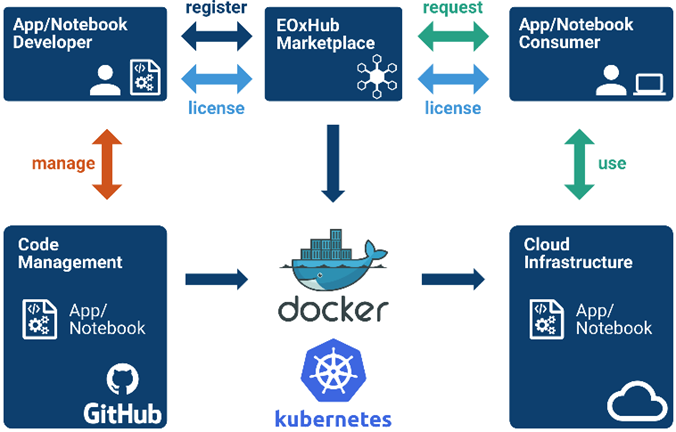

# DeepESDL Hub

The DeepESDL Hub is based on the existing software named EOxHub, 
which is also used to power, e.g., the 
[EuroDataCube (EDC) Marketplace](https://eurodatacube.com/marketplace)  
as well as the 
[EDC EOxHub Workspace](https://eurodatacube.com/marketplace/infra/edc_eoxhub_workspace).

EOxHub is a platform and workflow management runtime for Earth Observation 
services and apps. EOxHub can be branded to provide the DeepESDL Hub & 
Marketplace and be deployed on any cloud offering a managed Kubernetes
service. The designated cloud for DeepESDL, Amazon Web Services (AWS) in 
the Europe Frankfurt region, fulfils this requirement with the managed
Elastic Kubernetes Service (EKS).
Technically EOxHub is split into the *Control Plane* and the *Worker Plane*.
The Worker Plane is where all workloads from users are run at runtime. 
The Control Plane is configured to provide the following:

* User Management
* Access control
* User Workspaces (Tenants)
* Workspace Dashboard
* Service subscription management
* Marketplace
* allocation functions for cloud resources and Data Services
* deployment service
* workload management functions
* Docker Image administration/assignment
* Example notebook catalogue supporting user contributions
* automated verification of example notebooks
* accounting and billing (voucher handling)

Deploying user workloads on the Worker Plane is performed on configured 
autoscaling groups using the managed Elastic Container Service (ECS) of AWS. 
This setup ensures, that only actually required resources are used and 
thus need to be paid.

The figure above shows the App deployment in user Workspaces. 
The sequence of steps is: The App or Notebook Developer pushes the 
App source code to the Code Management tool, adds the App as Docker image, 
and registers the App at the Marketplace. The App Consumer discovers and
requests the App and triggers the deployment of the App to use it to their 
workspace to be run on the cloud infrastructure. The App is now available
to be used by the Consumer within the resources provided in their 
workspace subscription.

EOxHub is extended in two ways to provide the DeepESDL 
*Collaborative Development Tools*:

* Extended support for teams as part of the multi-user plan. 
  Allow for easier sharing of versioned notebooks and other artifacts 
  within the team but not necessarily the public.
* Integrated support for Machine Learning (ML) workflows. 
  This includes the versioning, sharing, and collaborative using of 
  all ML artifacts like code, data, models, results, etc. 
  Based on user feedback, the readily available Open-Source tools 
  like Data Version Control (DVC), MLflow, Kubeflow, or similar, will
  be integrated during the project.
