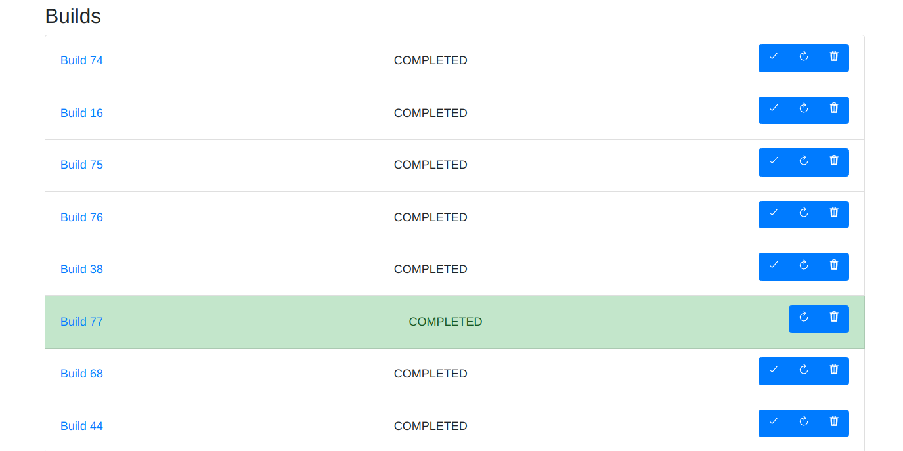
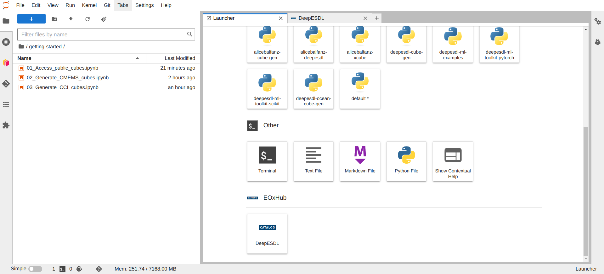
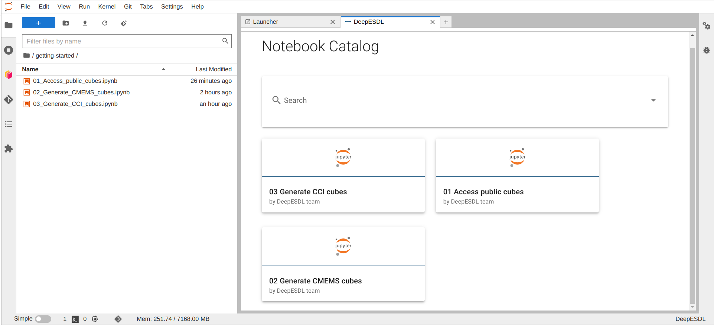
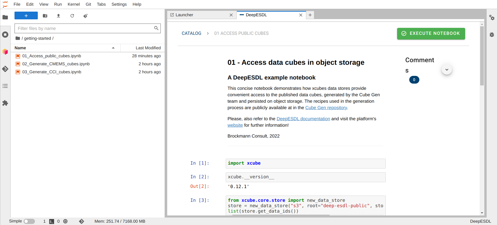

# DeepESDL JupyterLab

## Basic usage

This section provides a brief introduction for users to the basic features of
the JupyterLab environment as offered by DeepESDL. 
For more in-depth documentation on the various components, see the links in the
section [Further Information](further-information.md).

## Logging in and starting the JupyterLab profile

To use the DeepESDL JupyterLab environment, navigate to
<https://deep.earthsystemdatalab.net/> with a web browser (a recent version of
Firefox, Chrome, or Safari is recommended).

Before first usage, we will have to register you with the system. Currently, 
we are not operational yet and still in testing phase. There is the 
possibility to register already as an Early Adopter. To this, we kindly ask you 
to write as an email at `esdl-support@brockmann-consult.de` and we will see 
if we can already onboard you.

DeepESDL uses a GitHub to authenticate, so if you are already registered as a 
DeepESDL user, please use your GitHub account to log in. 
If your Jupyter server is not already running, you may be presented
with a menu of user JupyterLab profiles to use for your session; there might be 
one or more JupyterLab profiles to choose from, depending on the computational 
resources needs of your team. Please select a suitable profile for 
your current task; it might not always require the profile with the strongest 
computational resources available.
After choosing your environment, you will see a progress bar appearing for a few 
moments while it is started for you. 
The JupyterLab interface will then appear in your web browser, ready for
use.

## Changing a JupyterLab profile

If you have already started your session and need to change the JupyterLab profile, 
you can do this by selecting *Hub control panel* from the *File* menu within
JupyterLab. Then click the `Stop my server` button and wait for your current
server to shut down. When the `Start my server` button appears, you can click
on it to return to the user JupyterLab profiles menu.

## Logging out

To log out, select *Log out* from the *File* menu within JupyterLab. 

Note that your JupyterLab session will continue in the background even after
you have logged out, but will eventually be terminated due to inactivity. 
If you wish to stop your session explicitly,
you can use the hub control panel as described in the 
[Changing a JupyterLab profile](#changing-a-jupyterlab-profile) section above.

## Python environment selection of the Jupyter Kernel

If you wish to use a special set of python packages, you can adjust it in the 
top right corner of the notebook. Next, a drop-down menu will appear, and you 
can select the desired kernel environment from it. 

To get a custom environment which suits your needs, please contact the DeepESDL
team directly. 

## Creating custom team python environment

Up to two team members may create a custom python conda 
environment for a team. Please inform the DeepESDL Team 
who should be granted these permissions.

Steps to create custom team conda environments: 
1. Head over to https://deep.earthsystemdatalab.net/conda-store
2. Login with your GitHub Account which you also use to access the DeepESDL 
   JupyterLab
3. If you have never created a custom environment, there will be none listed.
4. Click on the Plus-sign next to *Environments*
5. In the top section, select the namespace for which to create the custom 
   environment. There might be more than one if you are part of several 
   teams. If you are unsure which namespace you should use, have a look 
   at the Server Options overview of the DeepESDL JupyterLab.
6. You may either choose an environment.yml file to upload or paste your 
   [environment configuration](https://docs.conda.io/projects/conda/en/latest/user-guide/tasks/manage-environments.html#create-env-file-manually) 
   into the window directly. 
7. Make sure to set a meaningful value to the environment's `name` property,
   so also your teammates will know what it is about. 
8. Once you are happy with your environment hit submit and grab a coffee. It 
   will take some time to create your custom environment. 
9. After submission, it will appear in the overview on 
   https://deep.earthsystemdatalab.net/conda-store/
10. You can click on the name of your newly created environment and see its 
    status. There are three different statuses: Building, Completed, Failed
11. If you click on the build number you can see the logs. This might be
      useful if the build has failed. 
12. Once the build is completed, you need to refresh your browser window
    to make it available in the kernel selection. Instructions how to change 
    the kernel to your custom environment are provided 
    [here](#python-environment-selection-of-the-jupyter-kernel)

You can also modify an existing environment and rebuild it; the conda-store 
will keep all the builds' logs.
It will look similar to the screenshot below. 

The conda-build highlighted in green is the one, which you will use in you 
DeepESDL JupyterLab, per default it is the latest successful build. If you 
wish to make a different build the one to be used in DeepESDL JupyterLab, 
select the checkmark in the blue button panel of the desired conda-build. 
The reload button in the blue button panel will trigger a rebuild of the 
conda-environment specification of the selected conda-build. The bin button 
deletes the conda-build of the selected conda-build. 

## Getting-started notebooks

You can find example notebooks in DeepESDL JupyterLab to help you to get 
started. 

To access them:

1. Head to the JupyterLab `Launcher`
     
   If your `Launcher` is not visible right away, you can open it via the `plus` 
   button in the top left corner, which is highlighted in blue in the 
   screenshot.  

2. On the bottom of the Launcher you see a tile called `CATALOG DeeESDL`. 
   Please select this tile. 

3. Once selected you see several example notebooks:
    

4. Select one of them, and you will see a preview of the notebook, to execute 
   the selected notebook click on `EXECUTE NOTEBOOK` in the top right corner. 
   

5. The notebook is copied into your workspace, and you can run it and adjust 
   it according to your needs.

