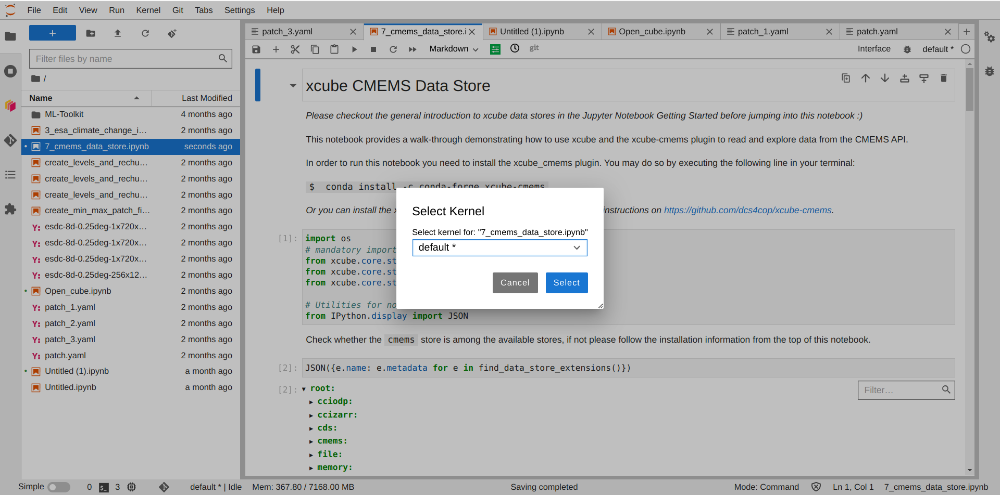
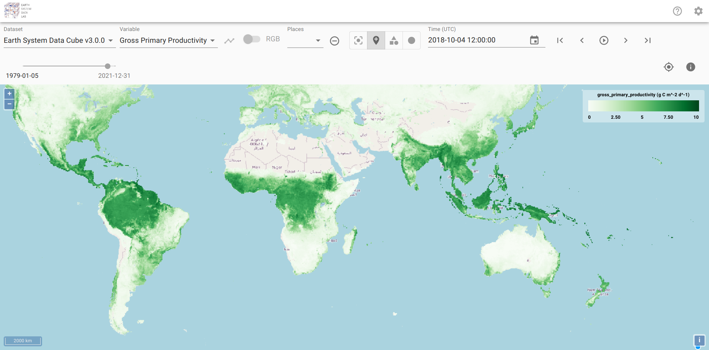

# User guide

This user guide helps you to get started with the main components of 
DeepESDL.

The growing set of DeepESDL's general functionalities comprises:
1. [DeepESDL JupyterLab](#deepesdl-jupyterlab)
2. [DeepESDL xcube viewer](#deepesdl-xcube-viewer)
3. [DeepESDL datacubes](#deepesdl-datacubes)
4. [DeepESDL datacube generation](#deepesdl-datacube-generation)

# DeepESDL JupyterLab

## Basic usage

This section provides a brief introduction for users to the basic features of
the JupyterLab environment as offered by DeepESDL. 
For more in-depth documentation on the various components, see the links in the
section [Further Information](#further-information).

### Logging in and starting the JupyterLab profile

To use the DeepESDL JupyterLab environment, navigate to
<https://deep.earthsystemdatalab.net/> with a web browser (a recent version of
Firefox, Chrome, or Safari is recommended).


Before first usage, we will have to register you with the system. Currently, 
we are not operational yet and still in testing phase. There is the 
possibility to register already as an Early Adopter. To this, we kindly ask you 
to write as an email at `esdl-support@brockmann-consult.de` and we will see 
if we can already onboard you.

DeepESDL uses a GitHub to authenticate, so if you are already registered as a 
DeepESDL user, please use your GitHub account to log in. 
If your Jupyter server is not already running, you may be presented
with a menu of user JupyterLab profiles to use for your session; there might be 
one or more JupyterLab profiles to choose from, depending on the computational 
resources needs of your team. Please select a suitable profile for 
your current task; it might not always require the profile with the strongest 
computational resources available.
After choosing your environment, you will see a progress bar appearing for a few 
moments while it is started for you. 
The JupyterLab interface will then appear in your web browser, ready for
use.


### Choosing a JupyterLab profile

If you don't already have a running DeepESDL Jupyter session, you will be 
presented with a list of one or more available user JupyterLab profiles when 
you log in. 
A user JupyterLab profile provides a particular combination of pre-installed 
package versions and resource settings. 

If you have already started your session and need to change JupyterLab profiles, 
you can do this by selecting *Hub control panel* from the *File* menu within
JupyterLab. Then click the ‘Stop my server’ button and wait for your current
server to shut down. When the ‘Start my server’ button appears, you can click
on it to return to the user JupyterLab profiles menu.

### Logging out

To log out, select ‘Log out’ from the ‘File’ menu within JupyterLab. 

Note that your JupyterLab session will continue in the background even after
you have logged out, but will eventually be terminated due to inactivity. 
If you wish to stop your session explicitly,
you can use the hub control panel as described in the 
[Choosing a JupyterLab profile](#choosing-a-jupyterlab-profile) section above.

### Python environment selection of the Jupyter Kernel

If you wish to use a special set of python packages, you can adjust it in the 
top right corner of the notebook. Next, a drop-down menu will appear, and you 
can select the desired kernel environment from it. 



To get a custom environment which suits your needs, please contact the DeepESDL
team directly. 


# DeepESDL xcube viewer

The DeepESDL xcube viewer is reachable at 
https://viewer.earthsystemdatalab.net .



The viewer contains public datasets only, but will later also provide user/team 
cubes when logged in. TThe login will be the same as for the DeepESDL JupyterLab.

For the functionality of the viewer, please refer to the documentation:
https://xcube.readthedocs.io/en/latest/viewer.html#functionality


# DeepESDL datacubes

DeepESDL provides a growing list of relevant variables for Earth System Science. 
Most of them have been derived from Earth Observation, but the compilation also 
includes model or re-analysis data if deemed useful.
DeepESDL is very grateful to all data owners for kindly providing the data sets 
and allowing us to process, and redistribute them free of charge. 
All datacubes generated and distributed by DeepESDL come without any warranty, 
neither from the owners, from the DeepESDL, nor from ESA.

At ingestion into the DeepESDL, data sets are typically transformed in space and 
time to fit to the common grid of the data cube, a process that necessarily 
modifies the original data. If you are looking for the original data, please 
follow the links within the dataset attributes for each variable and contact 
the data owners.

To access the documentation of available datasets, please have a look in the 
[datasets section](../datasets/datasets.md).


# DeepESDL datacube generation

The datasets provided by DeepESDL as data resource might not be sufficient 
for your science case. However, this should not stop you from creating the 
resources you need from source input data and enable you to do your research. 
DeepESDL carefully adheres to the reproducibility of dataset resources. Therefore, 
there are two approaches to generate datasets. 
One is fetching the data from an existing datastore without persisting the 
dataset, usually using a Jupyter notebook. 
If a dataset is persisted and furthermore based on input data that 
needs to be e.g. downloaded beforehand or other preprocessing steps are 
performed, then the cube generation recipe approach is the suitable one. 

## Cube generation recipe approach for static data cubes

### Cube specification format
For each data cube, a unique specification is created that describes 
the cubes spatio-temporal dimensions, resolutions, coverages, and the data 
sources used to generate the cube’s target data variables. To specify each 
cube, a dedicated JSON format is created that fully describes the target 
cube’s characteristics. We use a special GeoJSON Feature format for this 
purpose so each cube definition is both human- and machine-readable and can 
be ingested and rendered by a magnitude of existing tools. The GeoJSON 
Feature’s geometry represents the geographical coverage of a cube, while the 
GeoJSONFeature’s properties provide the remaining details. To describe many 
similar cubes, e.g., for using multiple spatial resolutions for same 
variables, a GeoJSON FeatureCollection may be used instead. To validate the 
JSON cube specification files, we provide a dedicated online JSON Schema 
in the DeepESDL dataset-spec GitHub repository:
 https://github.com/deepesdl/dataset-spec/blob/main/dataset-defs/template.schema.json

### Cube generation recipe

The cube generation recipe ensures, that an existing dataset provided by 
DeepESDL can be reproduced by following the recipe. Here we describe the 
recipe structure of the provided datasets within DeepESDL:  

Each predefined DeepESDL data cube is fully described in a transparent and 
comprehensive way by a dedicated sub-folder in the DeepESDL GitHub [repository 
cube-gen](https://github.com/deepesdl/cube-gen). 
Such sub-folder is what we call a cube generation recipe:
   `cube-gen/${cube-name}/`

It contains the machine-readable GeoJSON file that fully specifies the data 
cube `cube-gen/${cube-name}/cube.geojson` and provides the 
detailed human-readable information about the cube including how to generate 
it from sources in `cube-gen/${cube-name}/README.md`.  
After a cube has been released and published, we record the changes in 
`cube-gen/${cube-name}/CHANGES.md`.  
In each data cube sub-folder, other 
sub-folders may exist that contain resources and sources such as 
configuration files and Python modules.
We have defined the following common sub-folders, but others may be used 
too:   
*    `cube-gen/${cube-name}/input-collect/`     
      Fetch, download,or copy inputs.
*    `cube-gen/${cube-name}/input-preprocess/`   
      Transform, concatenate, convert to interm. Zarr.
*    `cube-gen/${cube-name}/output-merge/`  
      Merge interm. Zarrs to target cube.
*    `cube-gen/${cube-name}/output-postprocess/`   
      Apply any postprocessing.  

Cube generation recipes are designed to be comprehensive, transparent, 
reproducible, and relocatable. That is, with very little configuration 
changes, they should be executable in different environments.

### Dynamic data cubes from Data Stores

Persistently stored data cubes have the advantage that they have a physical 
representation, i.e. they “exists” at a given storage location. That way 
the data can be “frozen” and can be assigned a version and/or a DOI. In 
addition, access to static data cubes persisted in cloud object storage 
usually is fast and scalable. 

However, there are several issues and challenges with static cubes. Data 
sources of data cubes can become outdated,
or are simply updated, like it is the case for new EO data observations 
added to an existing product archive. In such cases, related data cubes should 
be updated too, hereby creating considerable maintenance effort. In addition,
the generation of static data cubes is in many cases a plain duplication of 
data that is actually defined and described elsewhere. The data cube must 
ensure to stay in sync with original data sources and metadata.
Finally, static cubes can only satisfy requirements of one user or use 
casein an optimal way. By definition, they do not allow for streamlined and 
tailored datasets. 

A possible solution to mitigate these issues and address 
the challenges are dynamic data cubes. Dynamic data cubes exist in-memory 
only and will provide data in a “lazy” way. That is, chunks of a data cube 
are fetched on-demand, hence computed on-the-fly, including all the 
required transformation steps starting with the ingestion of source data. 
Dynamic cubes are generated for a given configuration that describes the 
data cube to be generated. 

Dynamic data cubes for a given single data source can be easily retrieved 
using xcube data stores. The following Python code opens a data cube 
representing a Sentinel-2 L2A data cube with the SentinelHubAPI as data source:

```python
from xcube.core.store import new_data_store
store = new_data_store("sentinelhub", **credentials)
cube = store.open_data("S2L2A", 
                       variable_names=["B03","B06","B8A"],
                       bbox=..., 
                       spatial_res=...,
                       time_range=..., 
                       time_period=...
                       )
```

Dynamic cubes are application-specific and configured by individual users.

Overview of the possible xcube data stores that can be 
used to create dynamic cubes:

| Data store ID | Content                               | Access                            |
|---------------|---------------------------------------|-----------------------------------|
| sentinelhub   | Sentinel 1 to 3, Landsat, ...         | Requires registration, with costs |
| cmems         | CMEMS datasets                        | Requires registration, free       |
| cds           | Climate data store                    | Requires registration, free       |
| cciodp        | All ESA CCI datasets                  | Free                              |
| s3            | Any Zarr dataset on AWS S3 or similar | Depends on permissions            |


DeepESDL provides example notebooks for the different stores, which can be a 
good starting point for exploring the data stores. 

## Further information

 - The [JupyterLab documentation](https://jupyterlab.readthedocs.io/):
   an in-depth user guide for the JupyterLab interface.
 - [How to Use JupyterLab](https://www.youtube.com/watch?v=A5YyoCKxEOU):
   a short introductory video tutorial.
 - [Markdown cells](https://jupyter-notebook.readthedocs.io/en/stable/examples/Notebook/Working%20With%20Markdown%20Cells.html),
   a guide to writing Markdown in Jupyter notebooks.
 - The [xcube documentation](https://xcube.readthedocs.io/): user
   guide and API reference for the xcube libraries.
